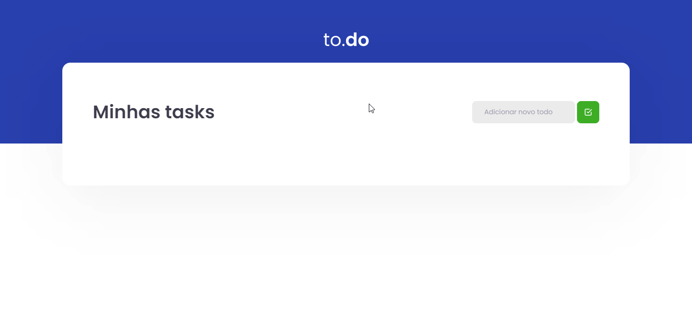
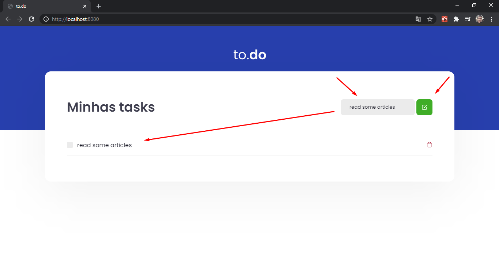
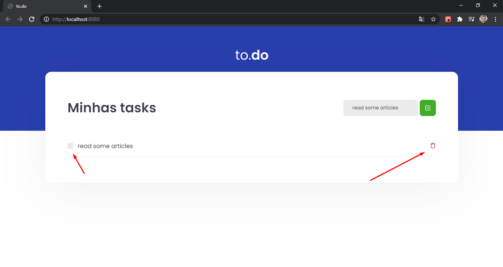

# TO.DO

<h1 align="center">
    
</h1>

## Índice

* [🧾 Sobre o projeto](#-sobre-o-projeto)
* [🚀 Principais tecnologias utilizadas](#-principais-tecnologias-utilizadas)
* [🔽 Como baixar o projeto](#-como-baixar-o-projeto)
* [💻 Como executar o projeto](#-como-executar-o-projeto)
* [👌 Como usar o app](#-como-usar-o-app)
<br>

## 🧾 Sobre o projeto

Uma aplicação no estilo _[todo](https://todoist.com/)_ feita com Javascript, Typescript e ReactJS 😃
<br>

## 🚀 Principais tecnologias utilizadas

* [React](https://reactjs.org/)
* [Typescript](https://www.typescriptlang.org/)
* [Webpack](https://webpack.js.org/)
* [Babel](https://babeljs.io/)
* [Sass](https://sass-lang.com/)

_(Você pode ver todas as dependências do projeto no arquivo [package.json](./package.json))_
<br>

## 🔽 Como baixar o projeto

```bash
$ git clone https://github.com/victorbadaro/ignite-react-todo-list
```
<br>

## 💻 Como executar o projeto

Os comandos abaixo usam o gerenciador de pacotes [yarn](https://yarnpkg.com/).

```bash
# 1. Instale as dependências do projeto
$ yarn

# 2. Execute a aplicação
$ yarn dev

# Você também pode gerar os arquivos para colocar a aplicação em produção com:
$ yarn build

# os arquivos estarão disponíveis na pasta dist/
```

Se tudo for executado corretamente, uma mensagem será apresentada no terminal informando que o código da aplicação foi compilado com sucesso:

```bash
Compiled successfully
```

Agora basta abrir o navegador e acessar: http://localhost:8080/

✅ Pronto! Se você seguiu corretamente os passos acima o projejto já estará sendo executado localmente em tua máquina.
<br>

## 👌 Como usar o app

* Informe alguma nova _task_ e clique no botão verde no topo direito da página. A nova _task_ informada será apresentada em forma de lista:
    

* Você pode concluir/renovar uma task (clicando no checkbox ao lado da descrição da task) ou deletá-la:
    

<br>

---
<p align="center">Este projeto foi criado usando este <a href="https://github.com/rocketseat-education/ignite-template-reactjs-conceitos-do-react">template</a> e desenvolvido com ❤ por <a href="https://github.com/victorbadaro">Victor Badaró</a></p>